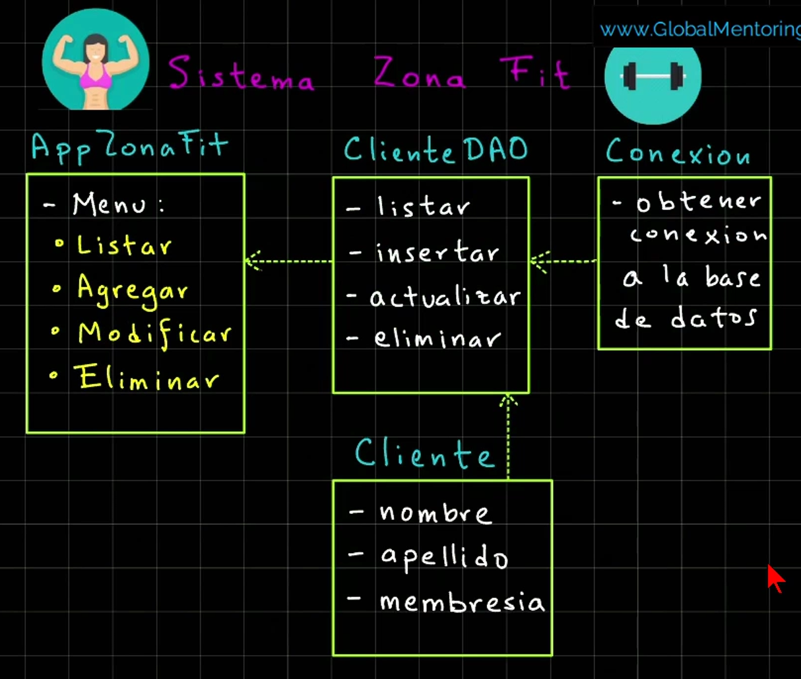

# :running: Zona Fit :bike:

Aplicacion de consola que permite el CRUD de clientes de un gimnasio.

## :fire: Finalidad del proyecto :fire:

- Aprender a integrar el jdbc al proyecto.

- Practicar la conexion con la base de datos mysql y realizar operaciones CRUD a traves de la aplicacion de consola.

- Aprender sobre el patron de disenio DAO.

## :books: Tecnologias utilizadas

- Java
- JDBC

## Estructura del proyecto



Se divide en 4 capas: **presentacion**, **datos** (contiene los DAOs y las interfaces), **conexion** y **dominio**

## :gear: Instalaciones necesarias :gear:

- MySQL Server (Ir al sitio oficial)
- MySQL Workbench (Ir al sitio oficial)

Para interactuar con la base de datos, primero debemos instalar el JDBC en nuestro proyecto. En el **pom.xml** se debe agregar el siguiente codigo para tener acceso al JDBC:

```<dependencies>
        <dependency>
            <groupId>com.mysql</groupId>
            <artifactId>mysql-connector-j</artifactId>
            <version>9.3.0</version>
        </dependency>
    </dependencies>
```

**No te olvides de recargar el proyecto :smile:**
